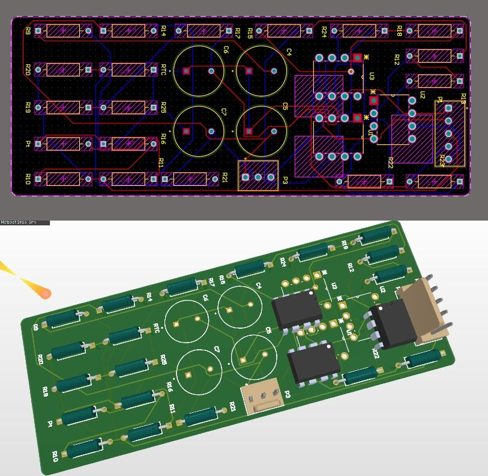
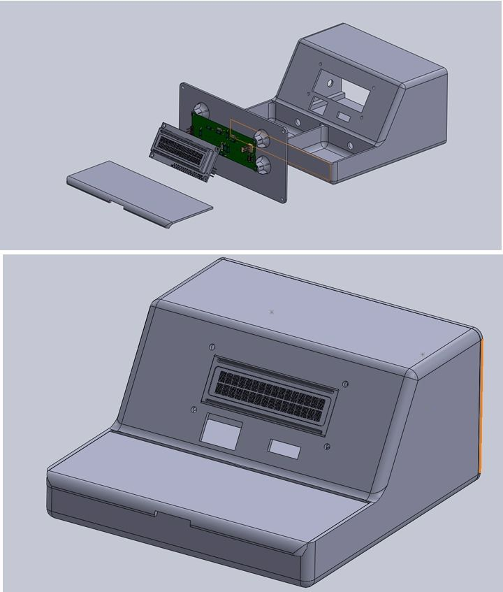

# 🏥 Dual-Mode Analog Thermometer  

 <!-- Add an image of your device or schematic if available -->

## 📌 Overview  
The **Dual-Mode Analog Thermometer** is a precision temperature measurement device designed using **analog components** to ensure high accuracy and reliability. Unlike fully digital thermometers, this design utilizes **thermistors, Wheatstone bridges, and an instrumentation amplifier** for precise temperature readings.  

This project was developed as part of the **EN2091 Laboratory Practice and Projects** module in our 3rd semester, focusing on **hands-on circuit design, sensor integration, and analog signal processing**.  

## ⚡ Features  
✅ **Dual-Mode Functionality** – Toggle switch to switch between **body temperature** and **liquid temperature** modes.  
✅ **High Accuracy** – Uses **thermistors, Wheatstone bridges, and an instrumentation amplifier** for precise readings.  
✅ **OLED Display** – Temperature readings are displayed on an **OLED screen**, with an **Arduino** used solely for display purposes.  
✅ **Stable Power Supply** – Converts **AC to +10V, -10V, and 5V** for reliable operation.  
✅ **Future Expansion** – Plans to integrate a **MUX** for additional modes.  

## 🛠️ Development Tools  
- **Circuit Simulation**: 🖥️ LTspice  
- **Schematic & PCB Design**: 🖊️ Altium Designer  
- **Enclosure Modeling**: 📐 SolidWorks  

## 📷 Hardware Overview  
| Component           | Function |
|--------------------|--------------------------------|
| **Thermistors** (NTC/PTC)  | Temperature sensing  |
| **Wheatstone Bridge**  | Signal conditioning |
| **Instrumentation Amplifier** | Precise signal amplification |
| **OLED Display** | Displays temperature readings |
| **Arduino** | Handles display functionality |
| **Power Supply** | Converts AC to +10V, -10V, and 5V |

## 🧩 Schematic & PCB Design

We designed both the **schematic** and **printed circuit boards (PCBs)** using **Altium Designer**. The project includes:

- 🧠 **Main Thermometer PCB** – Houses the signal conditioning circuit using Wheatstone bridges, thermistors, and an instrumentation amplifier.
- 🔋 **Dual Power Supply PCB** – Converts AC input into stable **+10V, -10V, and 5V** DC outputs. 

### 🖼️ Visuals:

> *Complete circuit schematic designed in Altium Designer.*

> *Main PCB for the analog thermometer circuit.*

> *Power supply PCB providing +10V, -10V, and 5V rails.*

---

## 🧱 Enclosure Design

To protect and house the electronics, we created a **cost-effective 3D-printed enclosure** using **SolidWorks**. The design features:

- 💡 **Compact & Ergonomic** layout for portability and ease of use.
- 🛠️ **Snap-fit joints** for quick assembly without screws.
- 🔄 **Modular access** to switch between body and liquid temperature modes.
- 📏 **Display window** for OLED visibility and button access.

### 🖼️ Visual:

> *3D-modeled enclosure designed for compactness and cost-efficient 3D printing.*

## 🚀 Getting Started  
### 🔧 Requirements  
- **Components**: Thermistors, Wheatstone bridge circuit, instrumentation amplifier, Arduino, OLED display  
- **Software**: LTspice, Altium Designer, SolidWorks, Arduino IDE  

### 🏗️ Setup Instructions  
1. **Assemble the Circuit** using the schematic provided.  
2. **Program the Arduino** with the provided firmware.  
3. **Power the System** using a **+10V, -10V, and 5V power supply**.  
4. **Use the Toggle Switch** to switch between temperature modes.  
5. **Observe the Temperature Readings** on the OLED display.  

## 🤝 Contributors  
- **Luchitha** – Circuit Design, PCB, and Enclosure  
- **Team Voltcrew** – Development & Testing  

